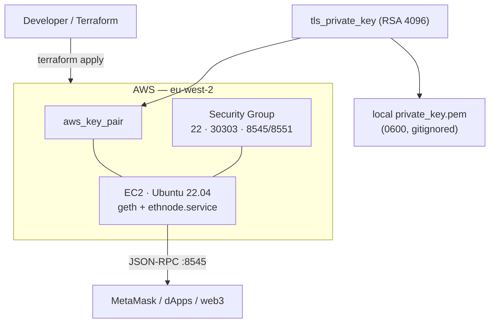

# Ethereum Network

[](https://github.com/valentevidal/ethereum-network/actions/workflows/terraform.yml)

Terraform to deploy a self-hosted **private Ethereum (Geth) network** on AWS. One
`terraform apply` provisions the node, generates its SSH key pair, opens the right
ports, installs Geth, lays down a custom genesis block, and runs the node as a
`systemd` service — ready to connect from MetaMask or any JSON-RPC client.

## Architecture



## What it provisions

| Resource | Purpose |
|---|---|
| `tls_private_key` + `aws_key_pair` | Generates an RSA-4096 SSH key and registers it with EC2 |
| `aws_security_group` | Opens SSH (22), Ethereum P2P (30303), and JSON-RPC (8545/8551) |
| `aws_instance` | Ubuntu 22.04 node; installs Geth and runs it via `ethnode.service` |
| `local_file` | Writes the private key locally (`0600`, gitignored) for SSH access |

## Prerequisites

- [Terraform](https://www.terraform.io/downloads.html) v1.6+
- AWS CLI configured with a profile named `ethereum-network` (or edit `provider "aws"` in `main.tf`)
- [Geth](https://geth.ethereum.org/downloads) (used locally by `setup.sh` to build the genesis block and accounts)

## Quick start

```bash
# Generates genesis/accounts/keystore, writes terraform.tfvars, then applies.
./setup.sh
```

Prefer to drive it yourself?

```bash
cp terraform.tfvars.example terraform.tfvars   # then fill in the paths
terraform init
terraform apply
```

Terraform outputs the node's `public_ip` when it's done.

## Inputs

| Name | Description | Default |
|---|---|---|
| `allowed_ssh_cidr` | CIDRs allowed to SSH (22). Restrict to your IP in real use. | `["0.0.0.0/0"]` |
| `ssh_private_key_path` | Path to the private key used for the remote-exec connection | — |
| `genesis_file_path` | Path to the genesis file | — |
| `password_file_path` | Path to the account password file | — |
| `keystore_file_path` | Path to the keystore directory | — |
| `keystore_file_name` | Keystore filename for the main account | — |
| `service_file_path` | Path to the `ethnode.service` unit file | — |

## Outputs

| Name | Description |
|---|---|
| `public_ip` | Public IP of the Ethereum node |
| `account_id` | AWS account ID the node was deployed into |
| `private_key_pem` | Generated SSH private key (**sensitive**) |

## Connect with MetaMask

Add a custom network:

- **New RPC URL**: `http://<public_ip>:8545`
- **Chain ID**: `4224` (also set in `genesis.json`)
- **Currency symbol**: `ETH`

Import an account with its private key (extract it from the keystore with
[keythereum](./keythereum) if needed).

## Security notes

- **SSH is open to `0.0.0.0/0` by default** for convenience — set `allowed_ssh_cidr`
  to your own IP for anything beyond throwaway testing.
- JSON-RPC (`8545`) is exposed publicly so MetaMask can reach it; lock this down or
  front it with a reverse proxy / allowlist for any real workload.
- The generated key is written to `private_key.pem` with `0600` perms and is
  gitignored (`*.pem`) — never commit it.
